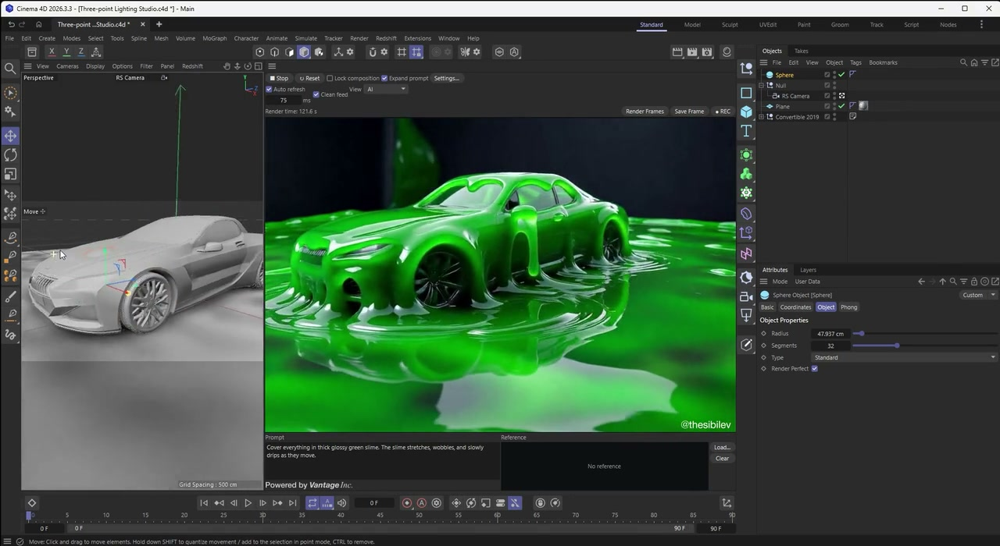
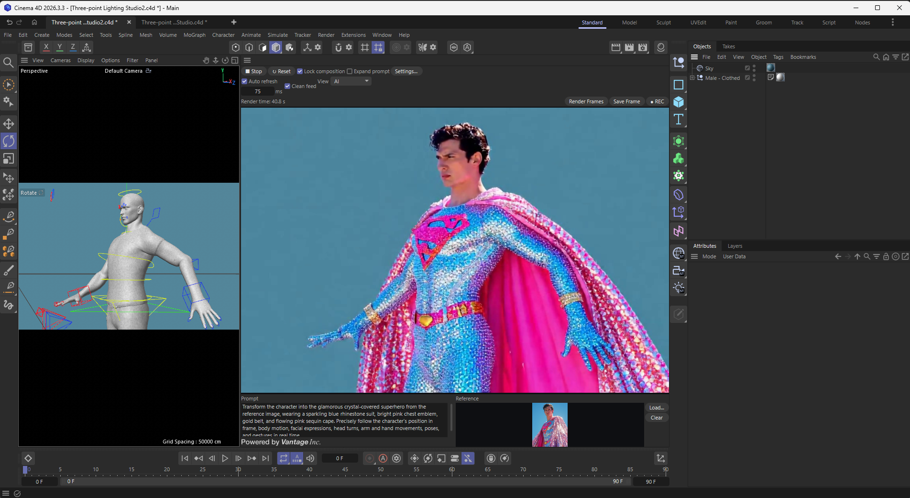
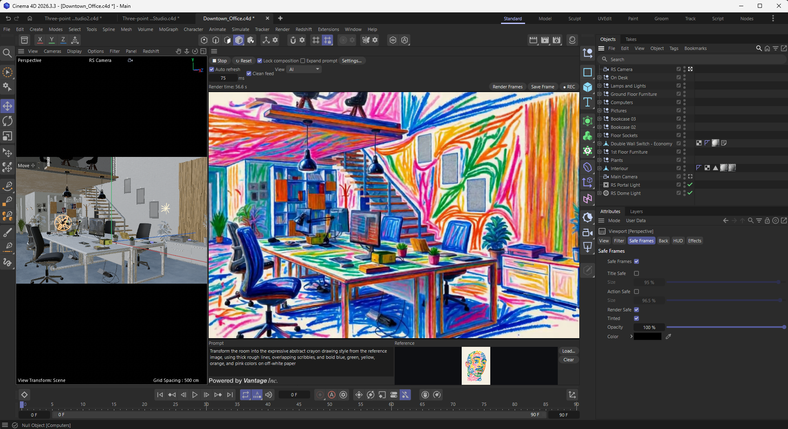

# LucyLive — AI Render for Cinema 4D

Created by [**VantageInc**](https://vantageinc.co/) **/** [**@thesibilev**](https://www.instagram.com/thesibilev/).

  <strong>Turn your Cinema 4D viewport into a real-time AI creative preview.</strong>

  
  
  
  

  <a href="https://github.com/VantageInc/LucyLive-AI-Render/releases/download/v0.2.2/LucyLive-v0.2.2-preview-windows.zip">
    <strong>⬇ Windows</strong>
  </a>
  &nbsp;&nbsp;·&nbsp;&nbsp;
  <a href="https://github.com/VantageInc/LucyLive-AI-Render/releases/download/v0.2.2/LucyLive-v0.2.2-preview-macos-apple-silicon.zip">
    <strong>⬇ Apple Silicon Mac — experimental</strong>
  </a>

## See it in action

  

  <a href="assets/lucylive-demo.mp4">▶ Watch the 21-second demo</a>

LucyLive keeps Cinema 4D in control of the camera, scene, and motion while a
remote generative model explores materials, lighting, atmosphere, and visual
direction. It includes live viewport updates, composition locking, reference
images, frame saving, and MP4 recording.

## More examples

## What is included

- The ready-to-install `LucyLive` plugin folder
- Pinned offline dependencies for the selected platform and Python 3.11
- No API keys, user data, renders, tests, or internal project files

## Requirements

- Cinema 4D 2024–2026 with Python 3.11
- 64-bit Windows 10/11, or Apple Silicon with macOS 14 or newer
- Native Apple Silicon mode; Rosetta is not supported
- Internet access
- A compatible fal.ai API key, model access, and account balance

## Install

1. Download the correct Windows or Apple Silicon release ZIP and extract it.
2. Put the complete `LucyLive` folder inside a folder used for Cinema 4D
   plugins.
3. In Cinema 4D, open **Edit → Preferences → Plugins**, click **Add Folder**,
   and select that plugins folder.
4. Restart Cinema 4D and open **Extensions → AI Render**.
5. Open **Settings…**, click **Install deps**, and wait for `Done`.
6. Restart Cinema 4D, save your API key in **Settings…**, enter a prompt, and
   click **Start**.
7. Click **Stop** when finished to close the billable real-time session.

**Install deps** uses Cinema 4D's bundled lightweight Python. It does not start
`c4dpy` or require a separate Command Line/RLM license.

On macOS, make sure **Open using Rosetta** is disabled for Cinema 4D.

You can also provide the key through the `FAL_KEY` environment variable.

## License

LucyLive is free to use in personal and commercial creative projects. You may
share the official repository link. Reselling, mirroring, repackaging,
redistributing the plugin files, and distributing modified versions are not
permitted.

This is a proprietary source-available preview, not an open-source release.
See the [LucyLive Preview License](LICENSE.md) for the complete terms.

## Cloud processing and cost

LucyLive connects to the
[`decart/lucy-2-5/realtime`](https://fal.ai/models/decart/lucy-2-5/realtime/api)
model through fal.ai. Prompts, viewport frames, and optional reference images
are sent to external cloud services for processing.

As of **July 27, 2026**, fal.ai lists Lucy 2.5 at **$0.04 per second**
(approximately **$2.40 per minute**) of processed video. Pricing and service
terms can change, so check the
[current Lucy 2.5 page](https://fal.ai/lucy-2.5) before use. Charges accrue
while a real-time session is active. Always click **Stop** when finished.

If you choose **Save key**, the API key is stored as plain text in the local
Cinema 4D preferences under `lucy_live/config.json`. On shared workstations,
prefer the `FAL_KEY` environment variable and do not save the key in the
plugin.

Do not send confidential scenes, personal data, or reference images unless you
are authorized to upload them. Third-party terms and privacy policies apply;
see the [fal.ai Legal Center](https://fal.ai/legal).

## Compatibility note

This is preview version **0.2.2**. Windows is the verified platform. The native
Apple Silicon package is experimental until the full Cinema 4D workflow has
passed validation on physical Mac hardware. Intel Macs and Rosetta mode are not
supported.

  

Created by [**VantageInc**](https://vantageinc.co/) **/** [**@thesibilev**](https://www.instagram.com/thesibilev/).
