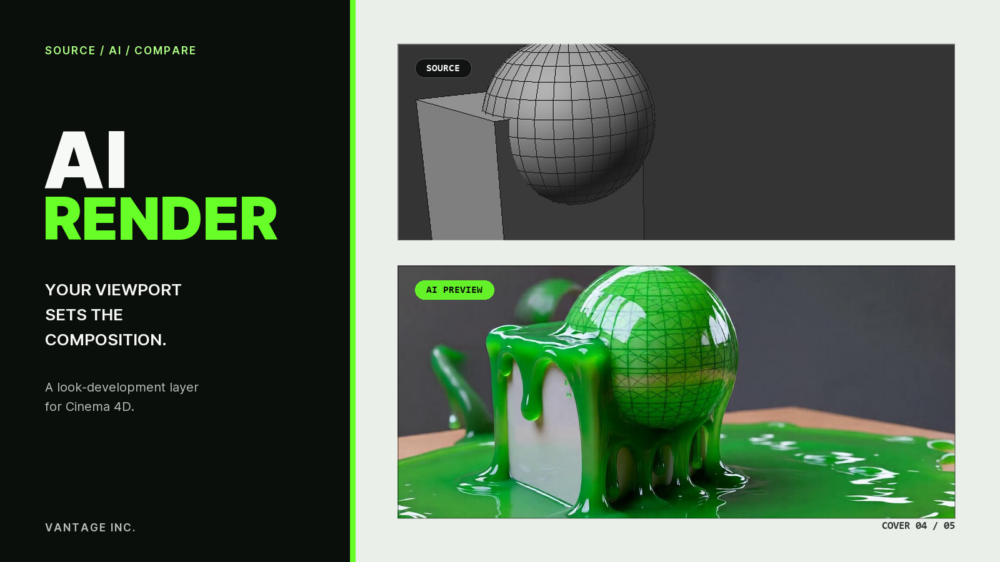

# LucyLive — AI Render for Cinema 4D

  <strong>Turn your Cinema 4D viewport into a real-time AI creative preview.</strong>

  
  
  

LucyLive keeps Cinema 4D in control of the camera, scene, and motion while a
remote generative model explores materials, lighting, atmosphere, and visual
direction. It includes live viewport updates, composition locking, reference
images, frame saving, and MP4 recording.

Created by **[VantageInc](https://vantageinc.co/) / [@thesibilev](https://www.instagram.com/thesibilev/)**.

## What is included

- The ready-to-install `LucyLive` plugin folder
- Pinned offline dependencies for 64-bit Windows and Python 3.11
- No API keys, user data, renders, tests, or internal project files

## Requirements

- 64-bit Windows 10 or 11
- Cinema 4D 2024–2026 with Python 3.11
- Internet access
- A compatible fal.ai API key, model access, and account balance

## Install

1. Download this repository as a ZIP and extract it.
2. Copy the complete `LucyLive` folder to:
   `%APPDATA%\Maxon\Maxon Cinema 4D 20XX_*\plugins`
3. Restart Cinema 4D and open **Extensions → AI Render**.
4. Open **Settings…**, click **Install deps**, and wait for `Done`.
5. Restart Cinema 4D, save your API key in **Settings…**, enter a prompt, and
   click **Start**.
6. Click **Stop** when finished to close the billable real-time session.

You can also provide the key through the `FAL_KEY` environment variable.

## Cloud processing and cost

Prompts, viewport frames, and optional reference images are sent to an external
AI service. Active sessions may be billed. Do not upload confidential content
unless you are authorized to send it to the service.

## Compatibility note

This is preview version **0.1.0**. It targets Cinema 4D 2024–2026 on 64-bit
Windows and is not currently packaged for macOS.

  

